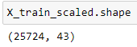

# Neural Network Charity Analysis

## Overview

For this project, we are to utilize the deep-learning neural networks in the Tensorflow program in Python to analyze the success of charitable donations. Through this analysis, we hope to help the organization predict where to make their investments. In order to succesfully make use of the deep-learning neural networks, we are going to the preprocess the data for the model, and then compile, train and avluate the model.

## Results

During the data reprocessing step, we removed the EIN and NAME identification columns since the primary column for our model will be the "IS_SUCCESSFUL' column due to the column contains data whether or not the charity donation was sufficiently used. 

The following columns were considered to be the features of the model:
- AFFILIATION — listed as "Affiliated sector of industry"
- CLASSIFICATION — listed as "Government organization classification"
- USE_CASE — listed as "Use case for funding"
- ORGANIZATION — listed as "Organization type"
- STATUS — listed as "Active status"
- INCOME_AMT — listed as "Income classification"
- SPECIAL_CONSIDERATIONS — listed as "Special consideration for application"
- ASK_AMT — listed as "Funding amount requested" 

### Evaluation of Model

- The first deep-learning neural network model we used consists of two hidden layers with 80 and 30 neurons respectively.
- The input data returns to us showing 43 features and 25,724 samples

- In order to increase the efficiency of the process, we used to ReLU activation functions for the hidden layers
- Results shows the model accuracy being below 75%.
- In order to increase the accuracy of the model, we utilized bucketing for ASK_AMT and organized the returned values by intervals.
- We also tried using the tanh acitvation function but it also did not help to improve the model's performance.

## Summary

After our analysis, we did not reach the target of 75% accuracy. We can assume that the model for this analysis simply was not outperforming as in this case, a 75% score is average especially in a model used to identify effectiveness. Due to the dataset consisting of binary classification, one supervised machine learning model that can be applied in this scenario is the Random Forest Classifier sampler model. With the Random Forest Classifier, we can combine multiple trees to display a classified results which can then be used in evaluating its accuracy performance.
